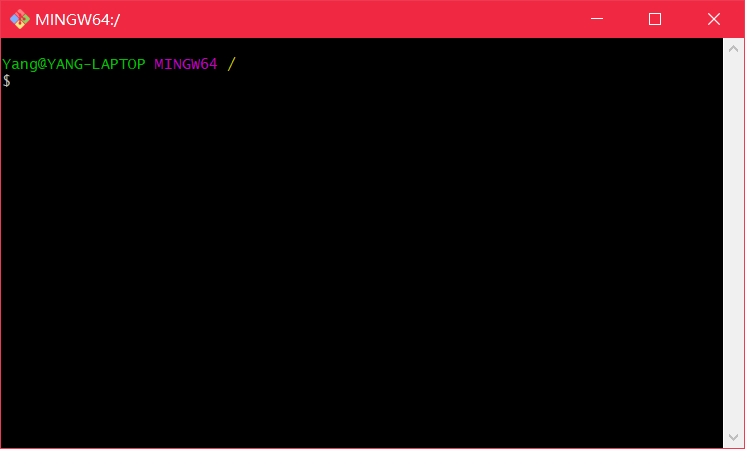
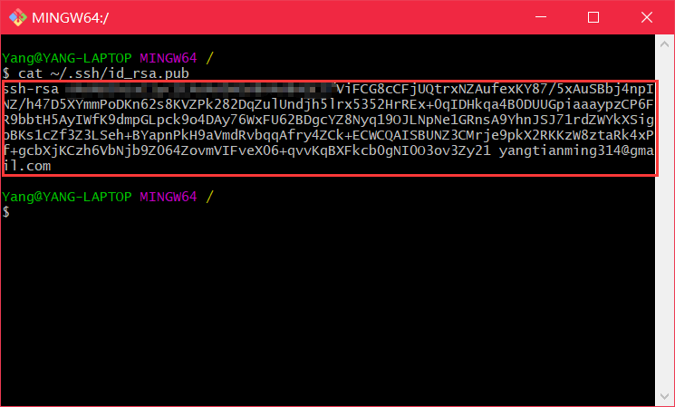
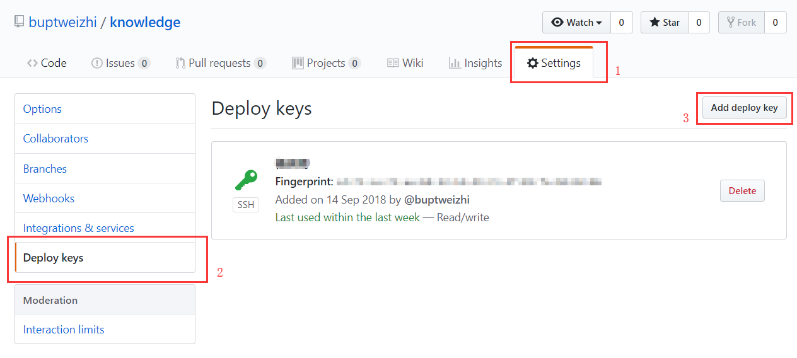
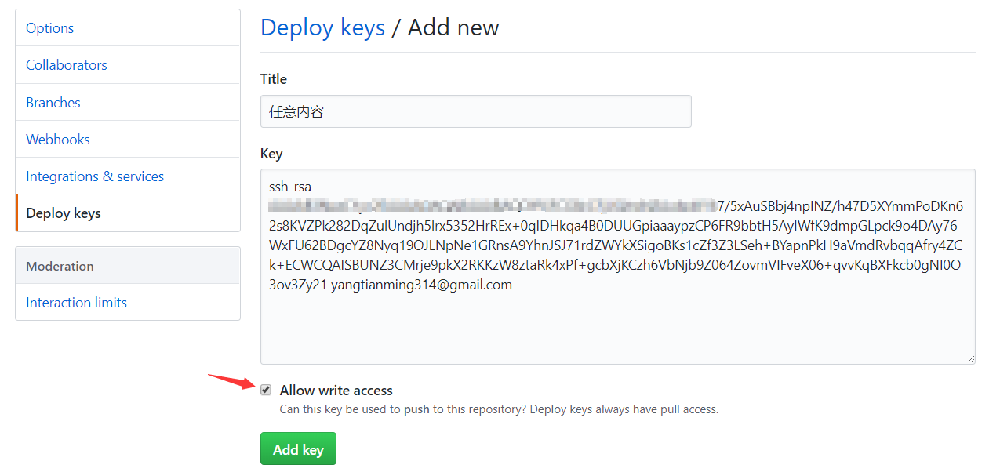
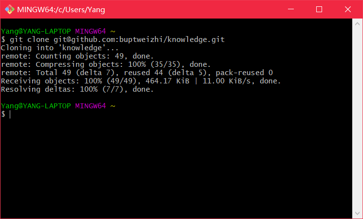
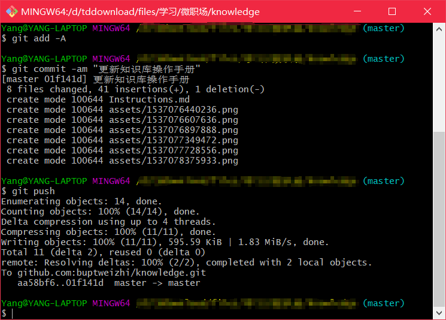
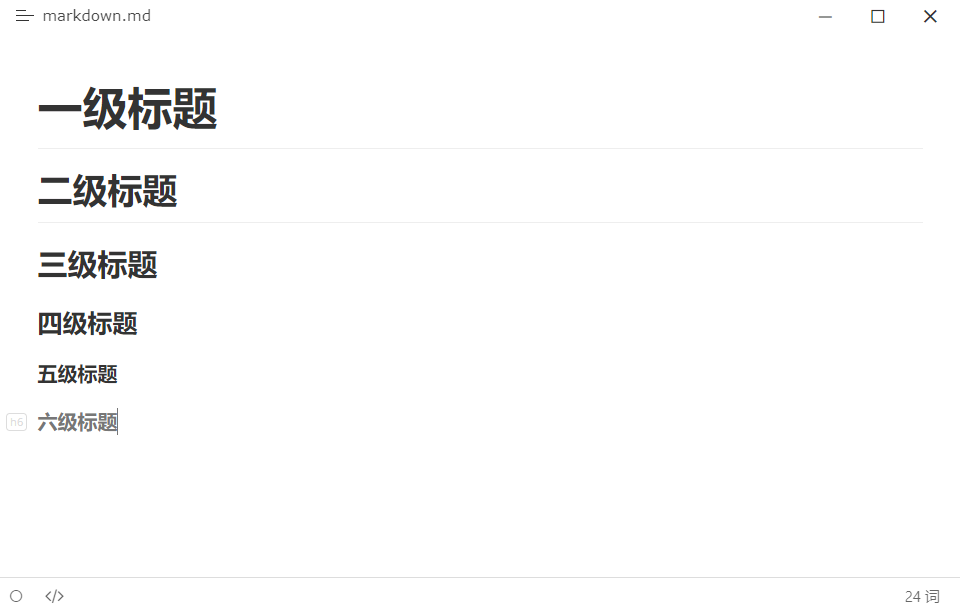

# 微·职知识库使用手册

## 更新方法

> 针对 Windows 平台

1. 从 https://git-scm.com/ 下载 Git 并安装


2. 打开 `git-bash.exe` 接下来的命令操作都是通过其完成



3. 输入 `ssh-keygen` 生成 ssh 公钥，遇到提示按 `Enter` 使用默认设置即可
4. 输入 `cat ~/.ssh/id_rsa.pub` 查看公钥内容，红框位置为需要复制到 GitHub 的内容



5. 打开 https://github.com/buptweizhi/knowledge ，进行登录，登录账号及密码在微·职有道云笔记 `第二届参谋部/账号管理.md` 中
6. 在 Settings - Deploy keys 页面点击 `Add deploy key` 新增部署密钥



7. 将第 4 步复制的 ssh 公钥粘贴到 `Key` 中，`Title` 可以为任意内容（最好能注明是谁添加的），一定要勾选 `Allow write access` 否则无法更新内容，完成后就具备了更新内容的权限



8. 输入`git clone git@github.com:buptweizhi/knowledge.git` 即可将 GitHub 远程仓库内的知识库内容克隆到本地，在本地编辑 [Markdown](#Markdown 介绍) 文本



9. 内容更新后，依次执行 `git add -A` `git commit -am "更新内容说明"` `git push` 这三条指令即可完成更新，打开 https://bupt-weizhi.gitbook.io/knowledge （有可能 GitBook 服务器未能实时编译内容导致访问内容无法显示，可以尝试等待一段时间后再访问）



## Markdown 介绍

> Markdown 详细语法介绍：https://www.appinn.com/markdown/
>
> 推荐使用 Typora 作为 Markdown 编辑器：https://www.typora.io/

### 标题

**代码**

```markdown
# 一级标题
## 二级标题
### 三级标题
#### 四级标题
##### 五级标题
###### 六级标题
```

**效果**



### 加粗

```markdown
**重点内容**
```

### 链接

```markdown
[说明文字](https://www.appinn.com/markdown/)
[页内链接](#Markdown 介绍)
```

### 引用

```markdown
> 引用内容
```

