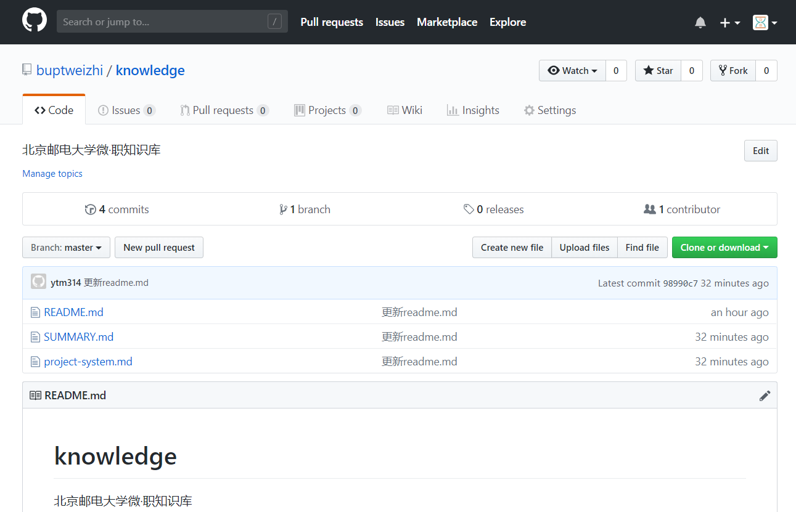

# 微·职知识库
> 微·职知识库使用 [GitBook](https://www.gitbook.com/) 构造，内容托管在 https://github.com/buptweizhi/knowledge，内容使用 MarkDown 语言编写，推荐使用 Typora 编写 MarkDown 文件

## 部署流程

> www.GitBook.com 国内可能遇到无法访问的情况，科学上网即可访问，但并不影响日常更新及访问
>
> GitBook 会从 GitHub 绑定的 repository 更新内容，只需更新 GitHub 即可更新内容

1. 注册 GitBook、GitHub 账号
2. 在 GitBook 上建立 organization 并创建项目，根据提示完成设置


3. 可以在 Teams 里添加组织成员


4. 从 Spaces 进入到「微·职知识库」，点击左下角设置，点击 Integrations


5. 在 Integrations 里，准备绑定 GitHub


6. 使用 GitHub 新建 repository



7. 继续在 Integrations 里绑定 GitHub 中创建的 repository
8. 等待同步完成后，访问 https://bupt-weizhi.gitbook.io/knowledge/ 即可查看内容


9. 使用 Git Bash 在本地创建本地仓库，并和远程仓库同步，即可更新内容，步骤略

## 页面说明

> 官方说明：https://toolchain.gitbook.com/structure.html

GitBook 通过 SUMMARY.md 作为目录索引，例如

```markdown
# Summary
* [前言](README.md)
* [项目制](project-system.md)
```

效果


