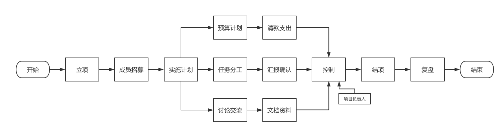

# 项目的流程

> Last Update: 2018.09.15
>
> Version: 0.1.0

## 1 立项

由[参谋部](TODO: 加详细介绍)发布项目，发布要求如下。一般项目向[合伙人](TODO: 加详细介绍)公开发布，特殊项目私募。

* 项目发布要求：

| 项目         | 要求                      |
| ------------ | ------------------------- |
| 标题         | 简单明了                  |
| 项目类型     | 包括项目分级              |
| 所需人数     | 只定义总人数              |
| 项目时间     | 如：沙河启动大会 20180926 |
| 内容         | 详细描述项目主要内容      |
| 报名截止时间 | 如：2018.09.15 22:00      |
| 要求         | 说明项目完成的要求        |

## 2 成员招募

项目组面向合伙人招募，在规定时间内完成招募，建立项目组群，备注为姓名+电话，邀请[项目对接人](TODO: 加详细介绍)进群。

## 3 项目组成立会议

项目第一次会议，在**两天**内召开项目组成立会议，要求项目对接人参加。

会议内容：

* 确立项目负责人
* 明确项目成员分工
* **完成[项目实施计划表](TODO: 链接到文档资源)**（在会议纪要中体现以上要点）

会议结束后**一天**内向项目对接人提交项目实施计划表。

## 4 项目实施过程

> TODO: 预算计划、讨论交流、会议纪要……

## 5 项目关键节点报告

项目进度 50% 的时候进行一次自发性复盘，并将复盘会议纪要和[项目关键节点报告](TODO: 连接到文档资源)提交到项目化办公室，必要时可由项目对接人组织召开关键节点复盘。

## 6 项目完成

> TODO: 项目完成后提交项目完成报告的时间期限
>
> TODO: 项目成员评级

项目负责人向参谋部提交[项目完成报告](TODO: 链接文档资料)以及[任务分工表](TODO: 链接文档资料)，并提交[数据提交核算清单](TODO: 链接文档资源)。

## 7 复盘

请参考[复盘制](../fupan/README.md)详细说明

